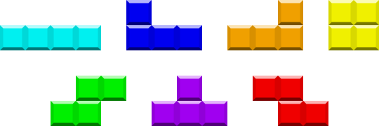
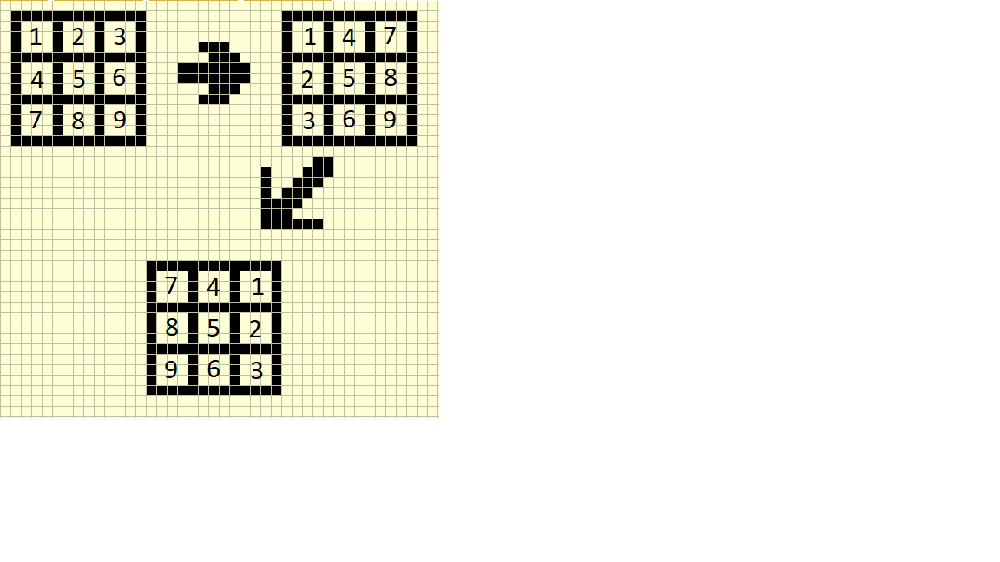

# Tetris Game with JavaScript
Setting up the Game:

	To start, we must first define the blocks. These are the different shapes 
	you are given in tetris. 
 

	Going along with the image, starting at the top left and going across, lets 
	define the first block as an, i, the next block as a J, the next as a L,
	and the next as an O. From the second row, going across, I defined the blocks 
	as a S, T, and Z respectively.

	In game, these blocks get chosen randomly and slowly move toward the bottom 
	of the game board. In the meantime, the player is allowed to horizontally 
	move and rotate the pieces. The player is allowed to speed up the downward 
	motion of the block by using the DOWN arrow key or by doing a hard drop with
	the space bar. While the game is running, the player will be notified of the 
	next incoming piece so plan your moves carefully. Also players may utilize 
	the shift key to swap a piece out. You may use this to your advantage to 
	replace a bad piece or make a tetris.

	For this game, I will define each block as a matrix. The matrixes are as 
	follows:
	
	I:[ [0, 0, 0, 0],
            [1, 1, 1, 1],
            [0, 0, 0, 0],
            [0, 0, 0, 0] ]
	    
        L:[ [0, 0, 0],
            [1, 1, 1],
            [1, 0, 0] ]

        J:[ [0, 0, 0],
            [1, 1, 1],
            [0, 0, 1] ]

        O:[ [1, 1],
            [1, 1] ]

        S:[ [0, 0, 0],
            [0, 1, 1],
            [1, 1, 0] ]
	    
        Z:[ [0, 0, 0],
            [1, 1, 0],
            [0, 1, 1] ]

        T:[ [0, 0, 0],
            [1, 1, 1],
            [0, 1, 0] ]
	    
        Now that we set uo the pieces, we als need the grid that we will be playing 
	on. This was setup by: 
		var canvas = document.getElementById('tetris');
  		var tetrisGrid = canvas.getContext('2d');
		tetrisGrid.fillStyle = 'white'; 
 		tetrisGrid.fillRect(0, 0, canvas.width, canvas.height); 
  		tetrisGrid.scale(20, 20);
		
Setting up the Mechanics:
	To rotate the pieces, a mathematical approach was taken. 
 
	The image shows that we must first transpose then reverse the matrix. The 
	rotation was then binded to the up arrow key for convience as well as keys 
	q and w
	
	To move the pieces left, right, and down the respective arrow keys were used 
	and setup with a document.addEventListener
	
How to Play:
	Movement: Use the arrow keys to control left, right and, down motion of the 
	tetrominoes. Use the up arrow to rotate (q and w keys will rotate the pieces too).

	Scoring: Each consecutive line complete will award more points. One line is worth 
	100pts, then 300pts for 2 lines, 700pts for 3 lines, and 1500pts for 4 lines (a tetris)

	Tatics: Use the Next block to see what the next piece will be. Use this to plan your 
	moves carefully.Use the shift key to hold pieces if you got a bad piece or save a piece 
	for big plays
	
Play the Game: 
	[Play](file:///C:/Users/Hchen/Desktop/Tetris/index.html "Tetris Game")

	
