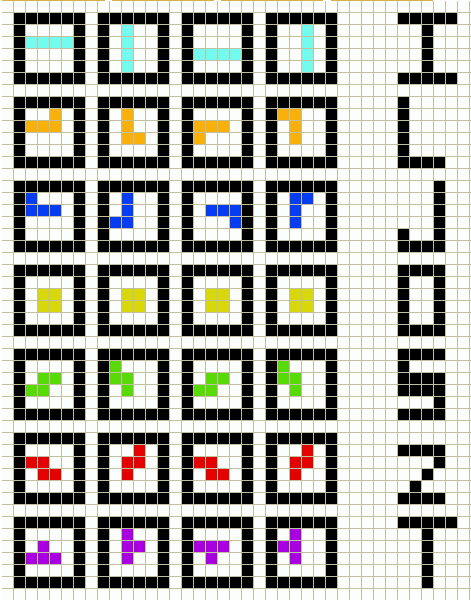

# Tetris Game with JavaScript
Setting up the Game:

	To start, we must first define the blocks. These are the different shapes 
	you are given in tetris. 
 
	Going along with the image, starting at the top left and going across, lets 
	define the first block as an, i, the next block as a J, the next as a L,
	and the next as an O. From the second row, going across, I defined the blocks 
	as a S, T, and Z respectively.

	In game, thses blocks get chosen randomly and slowly move toward the bottom 
	of the game board. In the meantime, the player is allowed to horizontally 
	move and rotate the pieces. There are a couple of ways to go about this. One
	is to define the base pieces as we jsut did and simply a apply a rotation to 
	it when needed. The problem here is the center of rotation for pieces i and 
	O are not about a block but in between one. 

	For this game, I will define each block as a 4x4. Not all spaces on the 4x4 
	will be used at one time but this space allows for rotations of different 
	pieces. If a spaces on the 4x4 is used we will represent that as a 1 and a 	
	0 if it is not used. each row will be defined as a binary and we will put 
	these rows together to form a hexadecimal

	Using this convention, the blocks will be:
	I: 0x0F00, 0x4444, 0x00F0, 0x2222
	L: 0x2E00, 0x4460, 0x0E80, 0xC440
	J: 0x8E00, 0x44C0, 0x0710, 0x6440
	O: 0x0660, 0x0660, 0x0660, 0x0660
	S: 0x06C0, 0x8C40, 0x06C0, 0x8C40
	T: 0x0C60, 0x2640, 0x0C60, 0x2640
	Z: 0x04E0, 0x4640, 0x0E40, 0x4C40
	
	
=================================================================================
Included files: 

=================================================================================
Running the program: 

	Run on your internet browser such as Chrome, FireFox, etc
--------------------------------------------------
